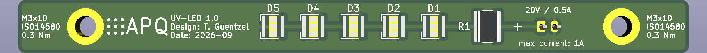

# QUIPS-C UV-LEDs PCB and Mounting Apparatus
UV-LEDs intended for QUIPS-C experiment, includes CAD-models of mount and PCB.\
Adsorption of Rubidium atoms on the vacuum chamber surfaces can lead to stray electric fields, negatively impacting the Rydberg transition. Ionisation by UV light aims to suppress this effect.

Available Files
-------
This repository includes:
- FreeCAD-files containing the model for the mounting apparatus
- KiCAD-files containing the design for the PCB housing the LEDs
Additional resources such as Gerber files will be added in the future.

Mounting Requirements
-------
The rectangular PCB is to be mounted via 2 M3-screws onto the aluminium mount. Heat transfer is maintained by thermal paste. The mount itself is fixated onto existing mounting posts attached to the QUIPS-C vacuum chamber.

Parts
-------
- LED: Luminus Devices SST-08-UV-A40H-F365-00 (5 pieces)
- Resistor: Vishay CRCW12184R02FKEKHP
- Connector: JST_PH_B2B-PH-K_1x02_P2.00mm_Vertical

Power Specifications
-------
LED specifications:
- central wavelength: **365 nm**
- absolute maximum forward current: **1 A**
- absolute maximum junction temperature: **100 °C**
- radiometric flux at 0.5A: **>810 mW**
- maximum forward voltage: **3.6 V**

Resistor specifications:
- resistance: **4 Ohm**
- maximum power: **3.5 W**

Overall design specifications:
- nominal operation at **20 V / 0.5A**, power draw: **10 W**
- total radiometrix flux: **~4 W**
- heating power: **~6 W**

License
-------
This work is released under the CERN-OHL-W.\
See [https://ohwr.org/cern_ohl_w_v2.pdf](https://ohwr.org/cern_ohl_w_v2.pdf) or the included LICENSE file for more information.
